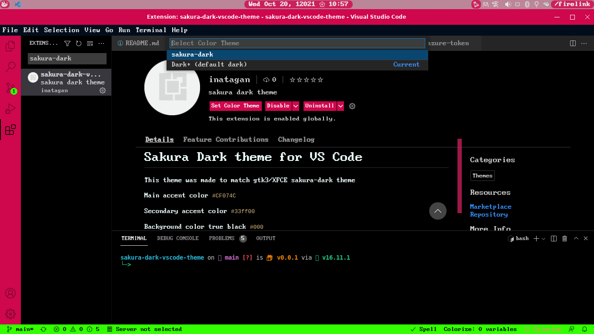
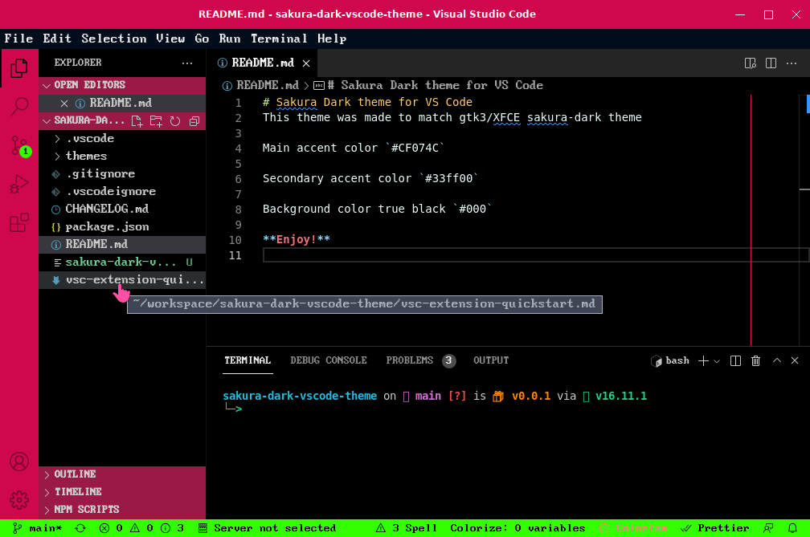
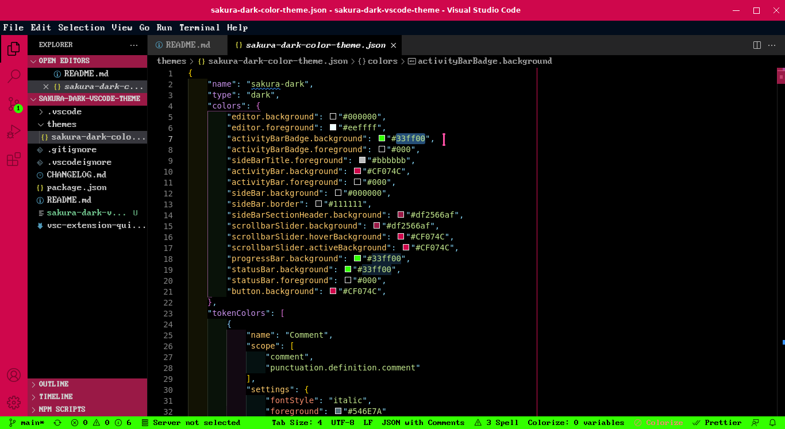
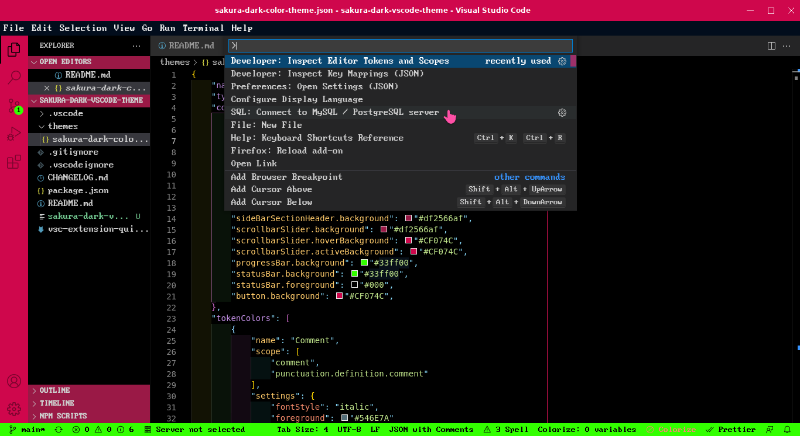

# Sakura Dark theme for VS Code
This theme was made to match gtk3/XFCE sakura-dark theme

---
## Installation
Launch VS Code Quick Open (Ctrl+P), paste the following command, and press enter.

`ext install inatagan.sakura-dark-vscode-theme`

---
## Preview
Main accent color `#CF074C`

Secondary accent color `#33ff00`

Background color true black `#000`

### full-screen

### floating-window

### editor look

### panel look

**Enjoy!**
